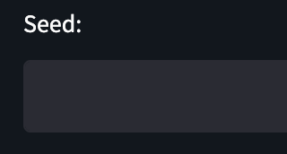
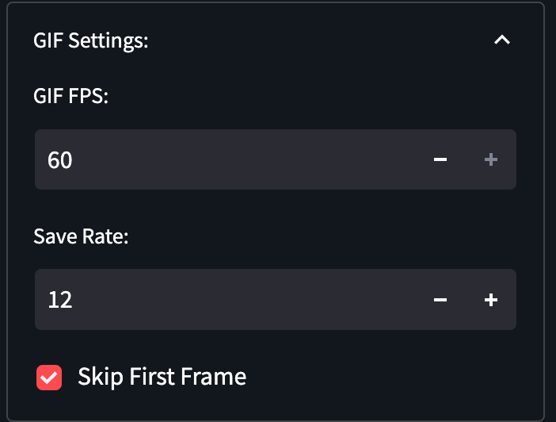

# Disco Diffusion UI <!-- omit in toc -->

Welcome to the world of AI generated art!

This guide will go through the basics of using the Disco Diffusion UI [hosted on GitHub](https://github.com/uetuluk/disco-diffusion-ui) and an introduction to the various settings available.

## Table of Contents

- [Introduction](#introduction)
- [Starting Out](#starting-out)
  - [Prompt](#prompt)
  - [Creating the Image](#creating-the-image)
  - [After Image Creation](#after-image-creation)
  - [Generated Image Details](#generated-image-details)
    - [Prompt Details](#prompt-details)
    - [Progress GIF](#progress-gif)
- [Adjusting Parameters](#adjusting-parameters)
  - [Basic Parameters](#basic-parameters)
    - [Sampling Steps](#sampling-steps)
    - [Width and Height](#width-and-height)
    - [Seed](#seed)
    - [Current Image ID](#current-image-id)
- [Retrieving Past Images](#retrieving-past-images)
- [Advanced Settings](#advanced-settings)
  - [Advanced Settings Tab](#advanced-settings-tab)
  - [Model Settings](#model-settings)
  - [Initial Image](#initial-image)
  - [GIF Settings](#gif-settings)
  - [Custom Models](#custom-models)
    - [Diffusion Model Format](#diffusion-model-format)
    - [Discoart Setup](#discoart-setup)
    - [Disco Diffusion UI](#disco-diffusion-ui)
- [Further Reading](#further-reading)

# Introduction

The Disco Diffusion is a tool that will give you an image depending on the prompt you enter and the settings you choose. The results are deterministic as inputting the same parameters will result in the same image output.

You should also be aware that Disco Diffusion prefers well constructed prompts and configurations to create decent looking images. If you prefer to quickly create images that look decent, **Stable Diffusion** is a better option.

# Starting Out

## Prompt

The journey to create a Disco Diffusion image starts with the prompt. 

Here is an excerpt from A Traveler’s Guide to the Latent Space by Ethan Smith about prompts.

> Your prompt should be in the following format
> 
> 
> <aside>
> 💡 General format: *Subject, by Artist (and artist), modifier 1, modifier 2…*
> 
> </aside>
> 
> Here’s a visualization for easier reference:
> 
> | Subject / Main Idea | , | By artist name
> or
> By artist name and artist name 2 and artist name 3
> (you can put as many as you like) | , | Modifiers
> (separated by commas) |
> | --- | --- | --- | --- | --- |
> | A beautiful photo of a lush landscape | , | By thomas kinkade and marc simonetti | , | 4k resolution, trending on artstation |
> 
> I also really like the way [G4L44D explained it in his guide:](https://www.notion.so/cd4badf06e08440c99d8a93d4cd39f51) 
> 
> 
> 

Once you have your prompt, you can input it in the following field. 


## Creating the Image

After the prompt is input, simply click the Start button.


You will notice that the Image Preview section will transform into a progress bar.


Once the server receives your request, it will answer with the canvas of your image. The progress bar is still empty at this point since the image is not being generated yet.

Afterwards, you will be able to see the progress as your image is being created.


## After Image Creation

Once the progress bar is full, your image is created. You can save it by right clicking on the image and clicking save as…


## Generated Image Details

There are also two more fields below your image that has important information about your generated image.

### Prompt Details

The `Prompt Details` field includes all the information you need to generate your image again. Here is the details for the image shown above.


### Progress GIF

The `Progress GIF` field includes a GIF that replays all the steps of the image generation.


# Adjusting Parameters

## Basic Parameters

The following is a description of the basic parameters you will need to adjust.

### Sampling Steps

The sampling steps is a basically the amount of work the AI will do on an image. The higher the step count, the more detailed the images will be. The maximum value is set as 300 in the UI.


### Width and Height

The width and height simply adjust the width and height of the resulting image. Even a single pixel value will change the resulting image, so do experiment with it.


### Seed

The seed is a unique value that will affect the resulting image directly. Same prompt coupled with the same seed value will result in the exact same image.  



### Current Image ID

This value is used by the Disco Diffusion server to identify the generated images. This value can be used to retrieve the image again afterwards. Beware that the image might have already been deleted.   


# Retrieving Past Images

You can retrieve old images generated by the server if the images have not been deleted. 

You simply input your image ID and press load past image.


You will be able to display your image and the progress GIF again. 


# Advanced Settings

Adjusting the following settings are only suggested for advanced users. You should read [this guide](https://www.notion.so/85efba7e5e6a40e5bd3cae980f30235f) to understand what they do. 

## Advanced Settings Tab


The following settings are located here.

- Clip Guidance Scale - `clip_guidance_scale`
- Maximum Clamp - `clamp_max`
- cut_ic_pow
- tv_scale
- range_scale
- sat_scale
- cutn_batches
- cut_overview
- cut_innercut
- cut_icgray_p
- eta

## Model Settings


The model settings can be used to change the diffusion and clip models, and toggle the secondary model. 

## Initial Image

The `Init Image` is used to upload the initial image. You can also adjust the following parameters here:

- skip_steps
- init_scale


## GIF Settings

The FPS of the generated GIF and the step recording rate can be adjusted here. Changes to these parameters will affect the resulting progress GIF. 

The first frame of the GIF is skipped to decrease the strobe effect, it can be placed back by unchecking the **Skip First Frame** and using the Past Images tab. 



## Custom Models

You will need to setup your Discoart to use your custom diffusion model first.

### Diffusion Model Format

The diffusion model definition should follow the example below to be compatible. 

You should use downloadable links for the .pt files.

```yaml
256x256_diffusion_uncond:
  sha: a37c32fffd316cd494cf3f35b339936debdc1576dad13fe57c42399a5dbc78b1
  sources:
    - https://clip-as-service.s3.us-east-2.amazonaws.com/discoart/256x256_diffusion_uncond.pt
    - https://openaipublic.blob.core.windows.net/diffusion/jul-2021/256x256_diffusion_uncond.pt
    - https://www.dropbox.com/s/9tqnqo930mpnpcn/256x256_diffusion_uncond.pt
  recommended_size: [ 512, 448 ]
  config:
    attention_resolutions: '32, 16, 8'
    class_cond: false
    diffusion_steps: 1000
    image_size: 256
    learn_sigma: true
    noise_schedule: linear
    num_channels: 256
    num_head_channels: 64
    num_res_blocks: 2
    resblock_updown: true
    rescale_timesteps: true
    timestep_respacing: 250
    use_scale_shift_norm: true
```

The required parameters are located in the [Discoart repository README](https://github.com/jina-ai/discoart#environment-variables).

### Discoart Setup
You should set the following environment variables and the following volume bind.

`docker-compose.yml`
```yaml
    environment:
      DISCOART_MODELS_YAML: "/etc/discoart/models.yml"
      DISCOART_DISABLE_REMOTE_MODELS: '1'
    volumes:
      - <PWD>/discoart/models.yml:/etc/discoart/models.yml:ro
```

`docker command`
```bash
docker run --entrypoint "python" -p 51001:51001 -v $(pwd):/home/jovyan/ -v $HOME/.cache:/root/.cache -v $(pwd)/models.yml:/etc/discoart/models.yml:ro -e DISCOART_MODELS_YAML="/etc/discoart/models.yml" -e=DISCOART_DISABLE_REMOTE_MODELS '1' --gpus all jinaai/discoart -m discoart serve
```

### Disco Diffusion UI

After you setup Discoart to use your custom diffusion model, you can should create a `model.private.yml` file inside the Docker container to tell the UI about your models. You can simply use the same `models.yml` in the previous step after renaming it.

```bash
docker run -p 8501:8501 -e SERVER_LOCATION="<SERVER LOCATION>" -e CUSTOM_MODELS='true' -v "$(pwd)"/models.yml:/app/models.private.yml:ro  uetuluk/disco-diffusion-ui:latest
```

# Further Reading

- [https://sweet-hall-e72.notion.site/A-Traveler-s-Guide-to-the-Latent-Space-85efba7e5e6a40e5bd3cae980f30235f#884b12fc2d4e464586bf672683aa2722](https://www.notion.so/85efba7e5e6a40e5bd3cae980f30235f)