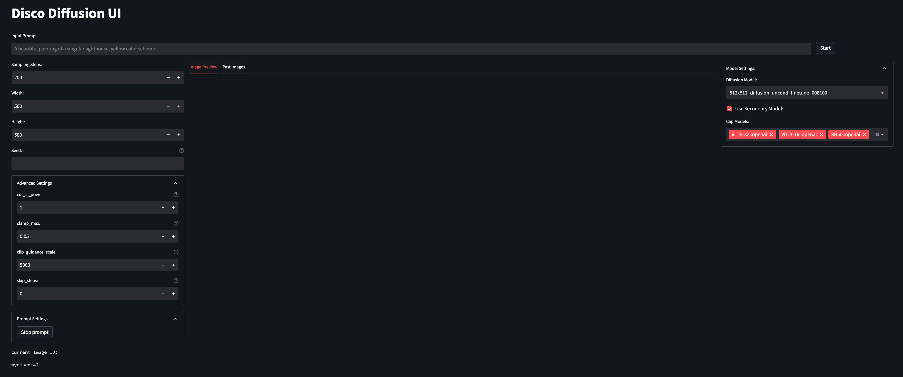

# Disco Diffusion UI

This is a GUI implementation to interface with a [DiscoArt](https://github.com/jina-ai/discoart) server.

The following settings can be adjusted.
* Prompt - `text_prompts`
* Dimensions - `width_height`
* Skip Steps - `skip_steps`
* Steps - `steps`
* Clip Guidance Scale - `clip_guidance_scale`
* Diffusion Model - `diffusion_model`
* Secondary Model - `use_secondary_model`
* Seed - `seed`
* Maximum Clamp - `clamp_max`
* cut_ic_pow
* Clip Models - `clip_models`
* init_scale
* tv_scale
* range_scale
* sat_scale
* cutn_batches
* cut_overview
* cut_innercut
* cut_icgray_p
* eta

Additionally, the UI supports initial images and generated GIF of the progress. 

# How to Setup

Simply run the following command to use the pre-built image

```bash
docker run -p 8501:8501 -e SERVER_LOCATION="<SERVER LOCATION>" uetuluk/disco-diffusion-ui:latest
```

Or follow the commands below to build and run yourself.

## Build Image

```bash
docker build -t streamlit .
```

## Run Image
```bash
docker run -p 8501:8501 -e SERVER_LOCATION="<SERVER LOCATION>" streamlit 
```

You can now view the UI at localhost:8501 or your-machine-ip:8501

# Development Quickstart

## 1. Create virtualenv

```bash
pyenv virtualenv 3.10.4 disco-diffusion-ui
pyenv local disco-diffusion-ui
```

## 2. Install requirements

```bash
make install-dev
```

## 3. Setup Environment
Use direnv and .envrc.example file.

```bash
mv .envrc.example .envrc
direnv allow .envrc
```